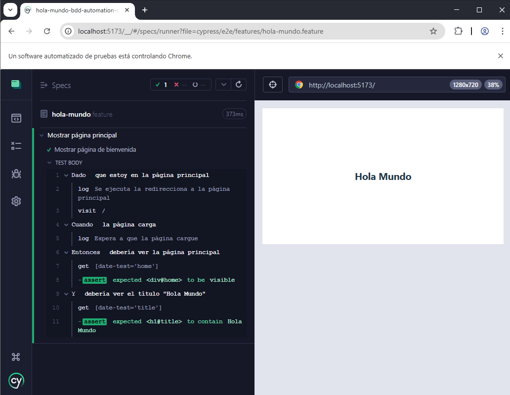

# Hola Mundo BDD Automation
Hola Mundo de una automatización BDD con cypress y cucumber

Node v20.19.2
npx 10.8.2
React 19.1.0
    


#  Característica Gherkin implementada

```
Característica: Mostrar página principal

  Escenario: Mostrar página de bienvenida
    Dado que estoy en la página principal
    Cuando la página carga
    Entonces debería ver la página principal
    Y debería ver el título "Hola Mundo"
```
# Estructura de proyecto

```
my-project/
├── cypress/
│   ├── e2e/
│   │   └── features/                     <--- Contiene archivos .feature en formato Gherkin
│   │          └── your-feature.feature 
│   └── support/
│              ├── step_definitions/      <--- Contiene los pasos de los archivos .feature
│              │     └── your-feature.steps.ts
│              └── commands.ts
│              └── e2e.ts
├── src/
│   └── (... your react code to testing)
├── cypress.config.ts  (o cypress.config.js)
├── package.json
├── tsconfig.json
└── …
```

#  Instalar
```
npm install
npx cypress install
```

#  Ejecutar prueba

Ejecutar en una terminal:
```
npm run dev
```

## Ejecutar en otra terminal:

Ejecución visual:
```
npm run test:e2e:open
```
Ejecución con salida por terminal:
```
npm run test:e2e 
```

Ejecución de pruebas de humo:
```
npm run test:e2e:smoke
```
o directamente:
```
npx cypress run --env tags="@Smoke"
```

Ejecución de pruebas de regresión:
```
npm run test:e2e:regression
```
o directamente:
```
npx cypress run --env tags="@Regression"
```



References: 
- https://cucumber.io/docs/gherkin/reference 
- https://filiphric.com/cucumber-in-cypress-a-step-by-step-guide#adding-parameters-to-step-definitions
- https://github.com/eccanto/base-cypress-cucumber-typescript/blob/master/tsconfig.json


